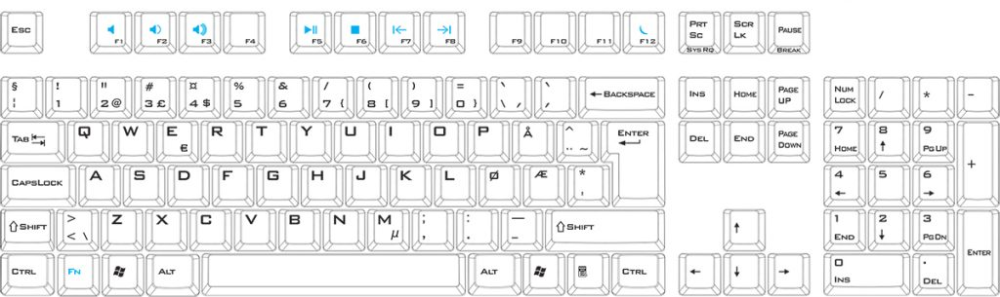

<p align="center"></p>
<h1 align="center">Keyboard </h1> 
<h4 align="right">Sep 23</h4>


<br>

Code snippets to read keyboard Python and Nodejs

<br>

# NodeJS
## KeyPress Package

> :warning: **Warning:** Funciona solo en primer plano, en segundo plano no detecta el presionar de ninguna tecla.
> 
Lectura simple de de teclado (Demo)
```
/**
 * Keyboard Control Demo on Linux / windows
*/

var keypress = require('keypress');
 
// make `process.stdin` begin emitting "keypress" events
keypress(process.stdin);

console.log("keyboard");
 
// listen for the "keypress" event
process.stdin.on('keypress', function (ch, key) {
  console.log('got "keypress"', key.name);
  if (key && key.ctrl && key.name == 'c') {
    process.stdin.pause();
  }else{
    if (key.name == "w" || key.name == "W") {
        console.log("Hello World");   
    }
  }
});
 
process.stdin.setRawMode(true);
process.stdin.resume();

```

<br>

keyboard control
```
/**
 * Keyboard Control Basic on Linux / windows
*/


var keypress = require('keypress');
 
// make `process.stdin` begin emitting "keypress" events
keypress(process.stdin);

console.log("keyboard");
 
// listen for the "keypress" event
process.stdin.on('keypress', function (ch, key) {
  //console.log('got "keypress"', key);
  if (key.ctrl && key.name == "c") {
    process.exit();
  }

  if (key.name == "right") {
    console.log("right");
  }

  if (key.name == "left") {
    console.log("left");
  }

  if (key.name == "up") {
    console.log("up");
  }

  if (key.name == "down") {
    console.log("down");
  }

  if (key.name == "escape") {
    console.log("esp");
  }

  if (key.name == "space") {
    console.log("space");
  }

});
 
process.stdin.setRawMode(true);
process.stdin.resume();
```
<br>

Modulo para lectura de teclado
```
 wating...
```

<br>

## Readline Package

Leyendo cadena de caracteres (Demo)
```
const readline = require('readline').createInterface({
    input: process.stdin,
    output: process.stdout
  });
  
  readline.question('Who are you?', name => {
    console.log(`Hey there ${name}!`);
    readline.close();
  });

```
<br>

Bucle que lee una cadena de caracteres hasta la palabra sea  “exit”
```
const readline = require('readline');

const rl = readline.createInterface({
  input: process.stdin,
  output: process.stdout
});

function readInput() {
  rl.question('Ingresa una palabra: ', (answer) => {
    if (answer.toLowerCase() === 'exit') {
      console.log('Saliendo de la aplicación...');
      rl.close();
    } else {
      console.log('Palabra ingresada:', answer);
      readInput();
    }
  });
}

console.log('Ingresa "exit" para cerrar la aplicación.');
readInput();
```

### Modulo para lectura de cadenas desde el teclado
keyboardInput.js
```
 const readline = require('readline');

function readKeyboardInput(callback) {
  const rl = readline.createInterface({
    input: process.stdin,
    output: process.stdout
  });

  function readInput() {
    rl.question('Ingresa una palabra: ', (answer) => {
      if (answer.toLowerCase() === 'exit') {
        console.log('Saliendo de la aplicación...');
        rl.close();
      } else {
        console.log('Palabra ingresada:', answer);
        readInput();
      }
    });
  }

  console.log('Ingresa "exit" para cerrar la aplicación.');
  readInput();

  rl.on('close', () => {
    callback();
  });
}

module.exports = { readKeyboardInput };

```

main.js
```
const { readKeyboardInput } = require('./keyboardInput');

function onExit() {
  console.log('La aplicación ha sido cerrada.');
  process.exit(0);  // Salir de la aplicación
}

readKeyboardInput(onExit);
```

<br>

<br>

# Leer los argumentos de un archivo Nodejs

## read arguments Standard Method (no library)
example: node app.js one two three

app.js
```
var args = process.argv.slice(2);
var program_name = process.argv[0]; //value will be "node"
var script_path = process.argv[1]; //value will be "yourscript.js"
var first_value = process.argv[2]; //value will be "first_value"
var second_value = process.argv[3]; //value will be "second_value"
console.log("All args: ", args );
console.log("second argument: ", second_value);
```

> :memo: **Note:** Con ```var args = process.argv.slice(2);``` se omiten que muestre el comando usado y la ruta del archivo en el array.  Pero igual permanecen en el array[0], array[1].

Ejemplo mostrando todo el array
```
const args = process.argv;
var program_name = process.argv[0]; //value will be "node"
var script_path = process.argv[1]; //value will be "yourscript.js"
var first_value = process.argv[2]; //value will be "first_value"
var second_value = process.argv[3]; //value will be "second_value"
console.log("All args: ", args );
console.log("second argument: ", second_value);
```

<br>

## Leyendo los argumentos como si fuesen un JSON (with library)
sample: node app.js -i 100 -y 200 -z 300

app.js
```
var argv = require('minimist')(process.argv.slice(2));
console.log("All args: ", argv );
console.log("z args: ", argv.z );

```


<br>

<br>


# Python
```
wating...
```


<br>

<br>

---
Copyright &copy; 2022 [carjavi](https://github.com/carjavi). <br>
```www.instintodigital.net``` <br>
carjavi@hotmail.com <br>
<p align="center">
    <a href="https://instintodigital.net/" target="_blank"></a>
</p>


# keyboard

